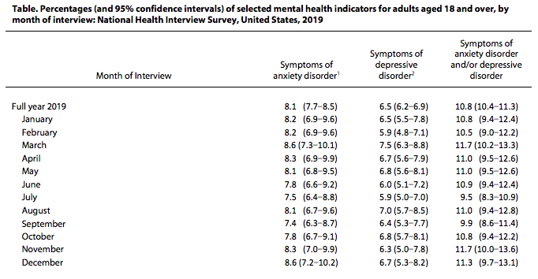

```{r, include = FALSE}
library(tidyverse)
library(modelr)
library(p8105.datasets)
knitr::opts_chunk$set(
  fig.width = 6,
  fig.asp = .6,
  out.width = "90%"
)
theme_set(theme_minimal() + theme(legend.position = "bottom"))
options(
  ggplot2.continuous.colour = "viridis",
  ggplot2.continuous.fill = "viridis"
)
scale_colour_discrete = scale_colour_viridis_d
scale_fill_discrete = scale_fill_viridis_d
```

By: <a href = "https://armaanahmed.github.io/">Armaan Ahmed </a> , <a href = "https://brojasnyc.github.io/br2598.github.io/">Brandon Rojas </a> , <a href = "https://albinomeese.github.io/hz2711.github.io/ ">Hansheng Zheng </a> , Yueli Ma


## Motivation

The COVID-19 pandemic has left an unprecedented impact on mental health, with especially staggering effects on the youth, elderly, and vulnerable populations, the magnitude of which was captured by multiple institutions in the United States including <a href = "https://www.publichealth.columbia.edu/public-health-now/news/covid-19-pandemic-impacts-mental-health-worldwide /">Columbia Mailman </a> and the federal government. It has reached a point that earlier this week, U.S. Surgeon General Vivek Murthy published a 53-page advisory reviewing circumstances behind a decade long increase and outlining direct actions institutions including state and federal governments can take to combat it.


There are many possible contributing factors to the increase in mental health disorders connected to the pandemic, including emotional hardship from deaths, a worsening opioid crisis, income volatility, and contracting the disease itself, along with lifestyle changes that came with the national effort against the disease, like an increase of weight <a href = "https://www.health.harvard.edu/blog/did-we-really-gain-weight-during-the-pandemic-202110052606#:~:text=As%20it%20turns%20out%2C%2039,2%25%20gaining%20over%2027.5%20pounds.">possibly induced by stress <a/>.

Another lifestyle change were lockdowns, which early in the pandemic, were enacted to encourage Americans to stay home and slow the spread of COVID-19. 

Complications of the lockdown included mass unemployment, widespread shutdown of small businesses, including an <a href="https://www.nytimes.com/2020/08/03/nyregion/nyc-small-businesses-closing-coronavirus.html">estimated one third of small businesses in NYC</a>, a <a href="https://www.bloomberg.com/news/articles/2020-06-08/black-business-owners-suffer-41-drop-in-covid-19-lockdowns">decline of 41% of black business owners</a> (If paywalled, <a href="https://drive.google.com/file/d/1so5hfe7FaEf6Newl-XENT8gfIQWiQKb9/view?usp=sharing">read here</a>), and increased incidence of mental health issues <a href="https://icap.columbia.edu/tools_resources/silver-survey-summary-sheet/">in the elderly</a>.

In addition, there is shortage of mental health professionals equipped to handle the increased incidence of cases. 


Innovations to increase access to care, whether from government or industry are needed and we will examine why.


## Related Work

Since the beginning of the pandemic, we have been inspired by 

<a href="https://www.hhs.gov/sites/default/files/surgeon-general-youth-mental-health-advisory.pdf" class="uri">https://www.hhs.gov/sites/default/files/surgeon-general-youth-mental-health-advisory.pdf</a>

https://www.hhs.gov/sites/default/files/surgeon-general-youth-mental-health-advisory.pdf 

Where possible, we compare the results with 2019 values from the National Health Interview Survey (NHIS) as a baseline. <a href="https://www.cdc.gov/nchs/data/nhis/mental-health-monthly-508.pdf/"> “Estimates of Mental Health Symptomatology” </a>


## Initial questions

Initially we were curious whether there was any the pandemic and circumstances around it could have had impact on the incidence of anxiety, depression, or other emotional disorders. After finding the Pulse Survey, asked:

What variables are most important for mental health? Age? Race, location or gender? 

How has mental health changed from the pre-pandemic baseline? 

How has the need for mental healthcare changed during the pandemic?
    

## Data

In April 2020, one month after COVID-19 was declared a national emergency, the National Center for Health Statistics (NCHS) teamed up with the Census Bureau to create the Household Pulse Survey, a 20 minute survey intended to record the impact of the pandemic on mental health.

For cleaning, the data required all dates be converted to Lubridate “Date” types from the original “Character”, and columns converted to factors as necessary, and NAs removed.

COVID mortality data was filtered by date and scaled as appropriate.

We will examine the first two subsets of the survey, which focus on incidence of anxiety and depression, and mental healthcare during 16 months of the pandemic.


## Anxiety and Depression - NCHS - Household Pulse Survey
<a href = "https://data.cdc.gov/NCHS/Indicators-of-Anxiety-or-Depression-Based-on-Repor/8pt5-q6wp"><h6>Available here</h6></a>

The value score is derived from a modified combination of two screening tests, the two-item <a href = "https://www.hiv.uw.edu/page/mental-health-screening/phq-2/"> </a> Patient Health Questionnaire (PHQ-2) and the two-item <a href = "https://www.hiv.uw.edu/page/mental-health-screening/gad-2 /"> Generalized Anxiety Disorder (GAD-2)</a>  scale. It represents the percentage of members of the subgroup column that, at the time of measurement, screened positive for symptoms of a depressive or anxious disorder, or both.

```{r echo=FALSE}
anxiety_depression_df = read_csv("Indicators_of_Anxiety_or_Depression_Based_on_Reported_Frequency_of_Symptoms_During_Last_7_Days.csv") %>% 
  janitor::clean_names() %>% 
   na.omit

head_ad = anxiety_depression_df %>% select(indicator, state, subgroup, time_period_label,value)

head(head_ad)
```
<h2>Mental Health Care - NCHS - Household Pulse Survey</h2>
<a href = "https://data.cdc.gov/NCHS/Mental-Health-Care-in-the-Last-4-Weeks/yni7-er2q"><h6>Available here</h6></a>


Four months into the survey, questions were added about the impact of the pandemic on mental healthcare. Measurements (“Value” column) here refer to the percentage of members of the subgroup column who, within 4 weeks of taking the survey, underwent any of the following:

a) took prescription medication for their mental health

b) received counseling or therapy from a mental health professional 

c) needed counseling or therapy from a mental health professional but did not get it (unmet mental health need)


```{r echo=FALSE}
mh_care_df = read_csv("Mental_Health_Care_in_the_Last_4_Weeks.csv") %>%  
  janitor::clean_names() 

head_mh = mh_care_df %>% 
  select(indicator, state, subgroup, time_period_label,value)

head(head_mh)

```

## Exploratory Analysis

The exploratory analysis for mental health data was used to provide preliminary context for current country demographics and supplement our analysis of mental health throughout the country. 
Mental health data from 2019 provides a baseline to compare changes in anxiety and depression levels following the outbreak of COVID-19. 




## Discussion:
<<<<<<< HEAD
From out exploratory analysis, we noticed that age was negatively correlated with frequency of anxiety or depression symptoms. The 18-29 year old age group had the highest frequency of mental health symptoms. Furthermore, women were more likely to experience anxiety and depression symptoms compared to men. Education level was also correlated with mental health symptoms, with bachelor's degree or higher having the lowest frequency of symptoms. From the spatial data overlaid onto the map of the United States, we noticed that generally, the southern states and west coast had higher frequency of mental health symptoms. Furthermore, looking at temporal data, we can see that spikes in covid-19 related deaths corresponded with proportion of those unable to find mental health care treatment, use of therapy or psychiatric drugs, and positive screening for anxiety. 
=======


>>>>>>> cf7b05af764877cee1ea90a44e06094083fa3b14
## What we can do:


Everyone reading this can make a difference, if you’re at Mailman you have, or will have, the skills to leave an impact on the future of mental health. 

In the wake of an <a href="https://usafacts.org/articles/over-one-third-of-americans-live-in-areas-lacking-mental-health-professionals/">intractable shortage of mental health professionals</a>, universal or accessibly priced, mobile, around the clock access to mental health treatment will be paramount for society to tackle the sharp increase in mental health disorders in the past two years.

There are immense career opportunities in the field of mental health, including telemedicine, behavioral healthcare, online therapy, and accessibility innovations using brain computer interfaces.

Since 2020, <a href="https://www.forbes.com/sites/katiejennings/2021/06/07/venture-funding-for-mental-health-startups-hits-record-high-as-anxiety-depression-skyrocket/?sh=4c4ea68a1116">record numbers of mental health startups have received venture capital funding</a>. 

A few examples:

• Online mental health/wellness service <a href="https://www.fiercehealthcare.com/tech/softbank-leads-mental-health-startup-cerebral-s-300m-round-propelling-valuation-to-4-8b.%20Published%20December%208,%202021.">Cerebral receiving $300M</a> from in a series C round led by SoftBank to expand services on its 200,000 patients

• <a href="https://www.fiercebiotech.com/medtech/digital-therapist-woebot-perks-up-90m-for-ai-powered-mental-health-platform.%20Published%20July%2021,%202021.%20Accessed%20December%2010,%202021.">Woebot closes $90M</a>: A free “AI/NLP powered chatbot” app that uses your personal input and generates individualized treatment using cognitive behavioral therapy inspired techniques.

• <a href="https://www.whatif.vc/portfolio">And more</a>